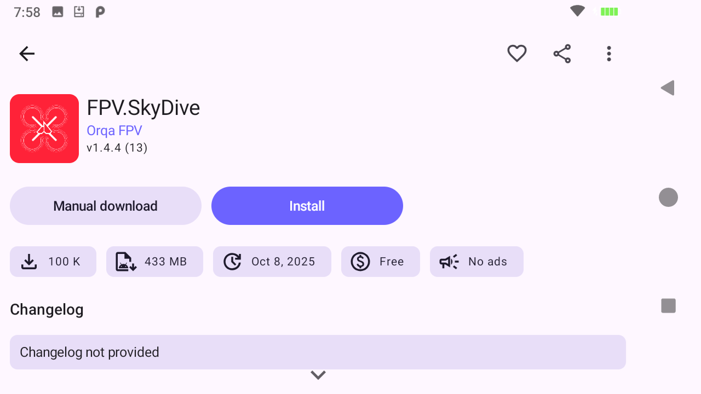
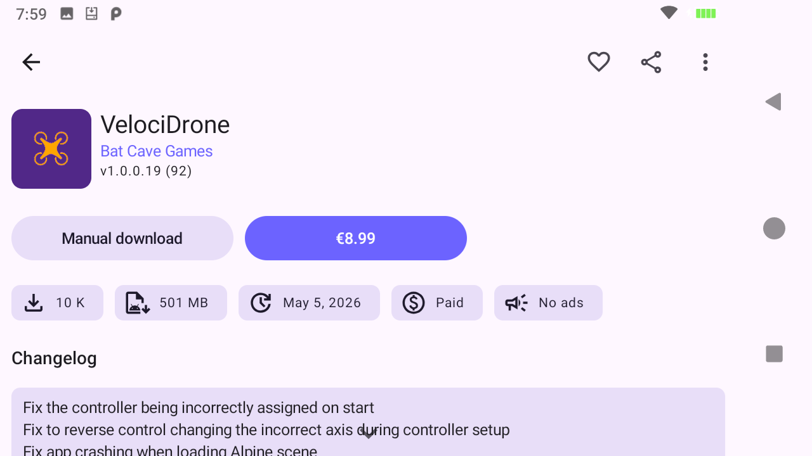
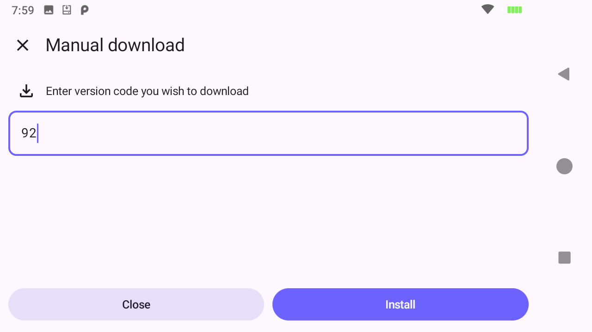

# AX12 Aurora Store

[](https://github.com/Flight/AX12-Aurora-Store/releases/latest)
[](https://github.com/Flight/AX12-Aurora-Store/releases/latest)
[](LICENSE)

An unofficial Aurora Store build adapted for the RadioMaster AX12 and similar Android 9 devices. It fixes a failure where games containing legacy OBB expansion files download their base APK, then stop and return to the store page. The affected OBB directory is recreated and validated immediately before the file is written.

This fork installs beside the factory Aurora Store as **AX12 Aurora Store** under the package id
`com.aurora.store.ax12`, so the original system application and its data remain untouched.

> **Still on 4.8.3-ax12.1?** Uninstall it first. That build was published under
> `com.aurora.store.debug` and signed with the public AOSP test key, so Android cannot update it in
> place; it has since been withdrawn. Releases from 4.8.3-ax12.2 onward are signed with the project
> key fingerprinted [below](#certificate-fingerprints) and update normally from one to the next.

From 4.8.3-ax12.3 onward the app also checks this repository's releases for its own updates and
offers them in the app. Earlier builds looked at upstream Aurora Store's update feed, which
advertises a different package signed by a different key.

## Download and install

1. Download the `.apk` from the [latest release](https://github.com/Flight/AX12-Aurora-Store/releases/latest).
2. Open the APK on the AX12 and allow installation from that source when Android asks.
3. Work through the two permissions first-run setup asks for. **External storage access** is what
   Android 9 needs to write large games' OBB expansion files; **Installer permission** opens
   Android's *Install unknown apps* screen, where you enable *Allow from this source* so the store
   can install anything at all. Both must show **Granted** before you continue.
4. Choose **Google**, select the Google account already configured in microG, and approve the microG prompt.
5. For paid games, buy them first from the Google Play Store on a computer or another device, using
   the same Google account. Aurora Store can install what that account owns, but it cannot buy
   anything.
6. Install games with the buttons described [below](#the-two-install-buttons). Confirm Android's
   final package installation prompt when it appears.

## The two install buttons

Every app page carries the same two buttons. Neither one asks you to handle an APK file yourself.

**Use the big button on the right.** On a free app it reads **Install**.



On a paid app the same button shows the price instead. For a title the signed-in account already
owns, it is not a purchase button: pressing it downloads and installs the app exactly as **Install**
does, expansion files included. All three paid games below were installed this way from scratch, and
none produced a purchase or payment prompt.

> **Buy paid games before you come here.** Aurora Store cannot complete a purchase. Buy the game
> first from the Google Play Store on a computer, phone, or tablet, using the same Google account
> you sign in with on the AX12. Once the account owns it, the price button on the AX12 downloads and
> installs it. If you have not bought it yet, that button cannot do it for you.



**Manual download** is the fallback, and it is a button inside Aurora Store rather than a sideload.
Use it when you need a specific older version code, or if the primary button does not work for some
app. It opens this dialog prefilled with the newest version code; press **Install** and the store
downloads and installs that build through the same path, OBB included. You never download an APK,
open a file manager, or approve an unknown source.



## Tested firmware

Verified on a physical RadioMaster AX12 with:

- Android 9 (API 28)
- Build display ID: `radiomaster-AX12`
- Firmware build: `eng..20260629.135400` (June 29, 2026)
- Build fingerprint base: `Radiomaster/full_tb8788p1_64_bsp/tb8788p1_64_bsp:9/PPR1.180610.011/06291403`

Other Android 9 firmware builds may work, but this is the version used for the complete clean-install and OBB download test.

## Tested games

All six were uninstalled with their data and OBB directories, then reinstalled through AX12 Aurora
Store 4.8.3-ax12.3 on a physical AX12 and launched. Every install below was performed by the store
itself; none needed a host-assisted workaround.

| Game | Version | Price | Primary button | OBB fetched | Result |
| --- | --- | --- | --- | --- | --- |
| FPV.SkyDive | 1.4.4 (13) | Free | **Install** | 349 MB | Installed and launched |
| FeelFPV | 1.7.1 (311) | Free | **Install** | none | Installed and launched |
| FeelFPV Tiny Whoop | 0.4 (50) | Free | **Install** | none | Installed and launched |
| FPV Freerider | 4.0 (40) | €3.39 | **€3.39** | none | Installed and launched |
| FPV Freerider Recharged | 2.5 (25) | €6.99 | **€6.99** | 195 MB | Installed and launched |
| VelociDrone | 1.0.0.19 (92) | €8.99 | **€8.99** | none | Installs and launches, but see the note below |

All six installed through the page's primary button, paid titles included, with no purchase prompt
for games the account owns. Both games carrying OBB expansion files fetched them correctly, which is
the failure this fork exists to fix. **Manual download** was also verified separately on all three
paid titles and works, but it is not required for them.

**VelociDrone is not usefully playable on the AX12.** It installs and launches, but the game freezes
for a few seconds at a time, every few seconds, even at the lowest graphics settings. This is a
limitation of the hardware rather than of the store or this fork.

## What changed

- App name changed to **AX12 Aurora Store**.
- Package ID is `com.aurora.store.ax12`, allowing side-by-side installation with the factory `com.aurora.store` package.
- OBB parent directories are recreated and checked immediately before opening the temporary download file.
- Releases are minified release builds signed with this project's key, rather than debug builds signed with the public AOSP test key, so the standard Aurora icon is used rather than a debug-badged one.
- In-app updates track this repository's releases instead of upstream Aurora Store's feed.

## Security and provenance

Downloads still come directly from Google Play through Aurora Store. This fork does not bypass purchases or licensing. Sign in with the account that owns paid apps.

This is an unofficial community fork. It is not affiliated with or endorsed by Aurora OSS, RadioMaster, Google, or the developers of apps downloaded through it. Source code is based on Aurora Store 4.8.3 and remains licensed under GPL-3.0.

## Upstream Aurora Store documentation

Aurora Store enables you to search and download apps from the official Google Play store. You can check app descriptions, screenshots, updates, reviews, and download the APK directly from Google Play to your device. 

To use Aurora Store, log in using Google Play account, when you first open and configure Aurora Store.

Unlike a traditional app store, Aurora Store does not own, license or distribute any apps. All apps, app descriptions, screenshots and other content in Aurora Store are directly accessed, downloaded and/or displayed from Google Play. 

Aurora Store works exactly like a door or a browser, allowing you to log in to your Google Play account and find the apps from Google Play. 

*_Please note that Aurora Store does not have any approval, sponsorship or authorization from Google, Google Play, any apps downloaded through Aurora Store or any app developers; neither does Aurora Store have any affiliation, cooperation or connection with them._*

[](https://f-droid.org/packages/com.aurora.store/)
[](https://apt.izzysoft.de/fdroid/index/apk/com.aurora.store)

## Features

- FOSS: Has GPLv3 licence
- Beautiful design: Built upon latest Material 3 guidelines
- Account login: You can login with either personal or an anonymous account
- Device & Locale spoofing: Change your device and/or locale to access geo locked apps
- [Exodus Privacy](https://exodus-privacy.eu.org/) integration: Instantly see trackers in app
- [Plexus](https://plexus.techlore.tech/) integration: Instantly see app compatibility without Google Play Services or with microG
- Updates blacklisting: Ignore updates for specific apps
- Download manager
- Manual downloads: allows you to download older version of apps, provided
  - The APKs are available with Google
  - You know the version codes for older versions 

## Limitations

- The underlying API used is reversed engineered from the Google Play Store, changes on side may break it.
- Provides only base minimum features
  - Can not purchase paid apps. Buy them from the Google Play Store on another device first; apps
    the signed-in account already owns did download and install normally in the
    [testing above](#tested-games), so read this as "cannot buy", not "cannot install".
  - Can not update apps/games with [Play Asset Delivery](https://developer.android.com/guide/playcore/asset-delivery)
- Multiple in-app features are not available if logged in as Anonymous.
  - Library
  - Purchase History
  - Editor's choice
  - Beta Programs
  - Review Add/Update
- Token dispenser server is not super reliable, downtimes are expected.  

## Downloads

This fork is published only from [GitHub Releases](https://github.com/Flight/AX12-Aurora-Store/releases/latest).
Every release ships a `SHA256SUMS.txt` alongside the APK.

Upstream Aurora Store, which this fork tracks, is distributed separately from the
[official website](https://auroraoss.com/), [GitLab](https://gitlab.com/AuroraOSS/AuroraStore/-/releases),
[IzzyOnDroid](https://apt.izzysoft.de/fdroid/index/apk/com.aurora.store) and
[F-Droid](https://f-droid.org/packages/com.aurora.store/). Those builds do not carry the AX12 OBB fix.

## Certificate Fingerprints

Release APKs are signed with this project's own key. Verify before installing with
`apksigner verify --print-certs <apk>`; anything else is not a build from this repository.

- SHA1: 9B:38:6A:FC:D4:B8:24:52:05:26:3F:74:3B:9F:3E:CC:E0:36:23:93
- SHA256: 9D:FE:54:24:E9:9A:6B:6F:3E:0E:65:E3:49:55:56:76:FB:BD:52:F7:6F:D8:42:D6:26:50:1A:11:40:CC:50:3E

Upstream Aurora Store builds are signed by Aurora OSS with a different key and are not
interchangeable with these.

## Building

Requires JDK 21 and the Android SDK. Point Gradle at the SDK with a `local.properties` file
containing `sdk.dir=/path/to/Android/sdk`, then:

```
./gradlew assembleVanillaDebug     # AOSP test key, installs as com.aurora.store.debug
./gradlew assembleVanillaRelease   # project key if signing.properties exists, otherwise unsigned
```

Gradle must *run* on JDK 21, not merely target it — the Hilt annotation-processing task ignores the
configured toolchain and compiles with whichever JVM Gradle itself is using.

To produce a signed release locally, copy `signing.properties.sample` to `signing.properties` and
fill it in. Both that file and the keystore it points at are gitignored. Tagged pushes (`v*`) build
and publish a signed release through [.github/workflows/release.yml](.github/workflows/release.yml),
which reads the same material from repository secrets.

## Support

Aurora Store v4 is still in on-going development! Bugs are to be expected! Any bug reports are appreciated.
Please visit [Aurora Wiki](https://gitlab.com/AuroraOSS/AuroraStore/-/wikis/home) for FAQs.

- [Telegram](https://t.me/AuroraSupport)
- [XDA Developers](https://forum.xda-developers.com/t/app-5-0-aurora-store-open-source-google-play-client.3739733/)

## Permissions

- `android.permission.INTERNET` to download and install/update apps from the Google Play servers
- `android.permission.ACCESS_NETWORK_STATE` to check internet availability
- `android.permission.FOREGROUND_SERVICE` to download apps without interruption
- `android.permission.FOREGROUND_SERVICE_DATA_SYNC` to download apps without interruption
- `android.permission.REQUEST_IGNORE_BATTERY_OPTIMIZATIONS` to auto-update apps without interruption (optional)
- `android.permission.MANAGE_EXTERNAL_STORAGE` to access the OBB directory to download APK expansion files for games or large apps
- `android.permission.READ_EXTERNAL_STORAGE` to access the OBB directory to download APK expansion files for games or large apps
- `android.permission.WRITE_EXTERNAL_STORAGE` to access the OBB directory to download APK expansion files for games or large apps
- `android.permission.QUERY_ALL_PACKAGES` to check updates for all installed apps
- `android.permission.REQUEST_INSTALL_PACKAGES` to install and update apps
- `android.permission.REQUEST_DELETE_PACKAGES` to uninstall apps
- `android.permission.ENFORCE_UPDATE_OWNERSHIP` to silently update apps
- `android.permission.UPDATE_PACKAGES_WITHOUT_USER_ACTION` to silently update apps
- `android.permission.POST_NOTIFICATIONS` to notify user about ongoing downloads, available updates, and errors (optional)
- `android.permission.USE_CREDENTIALS` to allow users to sign into their personal Google account via microG

## Translations

Don't see your preferred language? Click on the widget below to help translate Aurora Store!

<a href="https://hosted.weblate.org/engage/aurora-store/">
  
</a>

## Donations

You can support Aurora Store's development financially via options below. For more options, checkout the **About** page within the Aurora Store.

[](https://liberapay.com/whyorean)
<a href="https://www.paypal.com/paypalme/AuroraDev">
  
</a>

## Project references

Aurora Store is based on these projects

- [YalpStore](https://github.com/yeriomin/YalpStore)
- [AppCrawler](https://github.com/Akdeniz/google-play-crawler)
- [Raccoon](https://github.com/onyxbits/raccoon4)
- [SAI](https://github.com/Aefyr/SAI)
